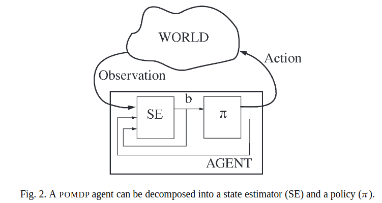

#Planning and acting in partially observable stochastic domains

----

**摘要**
    本文中,我们将运算研究中的技术应用于在部分可观察随机域中选择最优行为的问题.我们首先介绍马尔可夫决策过程（MDP）和部分可观察的MDP（POMDP）理论。然后，我们概述了一种用于离线求解POMDP的新算法，并展示了在某些情况下如何从一个POMDP问题抽象到有限存储器控制器。最后，我们讨论了与以前的工作有何关系，寻找精确解决方案的复杂性，以及寻找近似解决方案的可能性。
    考虑机器人在大型办公楼中导航的问题。机器人可以从走廊交叉口移动到交叉口，并可以对其世界进行局部观察。但是，它的动作并不完全可靠。有时候，当它打算移动时，它会移动到哪里或走得太远;有时，当它打算转动时，它会超调。它与观察有类似的问题。有时走廊看起来像一个角落;有时一个T-junction看起来像L型结。这样一个错误困扰的机器人如何导航?
    一般而言，机器人必须记住有关其行动和观察历史的信息，并使用这些信息以及对世界基础动力学的知识（地图和其他信息），以维持其位置的估计。许多工程应用遵循这种方法，使用类似卡尔曼滤波器[26]的方法来维持机器人空间不确定性的运行估计，表示为笛卡尔空间中的椭球或正态分布。不过，这种方法对我们的机器人不起作用。它的不确定性可能是不连续的：几乎可以肯定的是，它位于第四层或第七层的东北角，尽管它也承认它位于五楼。
    然后，鉴于其位置的不确定估计，机器人必须决定采取什么行动。
    在某些情况下，忽略其不确定性并采取适合最可能位置的行动可能就足够了。在其他情况下，机器人可能更好地采取行动以收集信息，例如搜索地标或阅读墙上的标志。一般而言，它将采取同时实现两个目的的行动.

----

#### 1. 概述

在本文中，我们将运算研究中的技术应用于部分可观察随机域中选择最优行为的问题。像上述那样的问题可以被建模为部分可观察的马尔可夫决策过程（POMDP）。当然，我们不仅对机器人导航问题感兴趣。工厂过程控制，石油勘探，运输物流以及各种其他复杂的现实情况也出现了类似的问题.
这基本上是一个规划问题：给出一个完整而正确的世界动态模型和奖励结构，找到一种最佳的行为方式。在人工智能（AI）文献中，通过向传统规划系统添加知识前提条件，已经解决了该问题的确定性版本[43]。因为我们对随机域感兴趣，所以我们必须偏离传统的AI planning模型。我们不是将规划作为可能只按预期执行的行动序列，而是将它们从情境映射到指定代理行为的行动，无论可能发生什么。在许多情况下，我们可能不想要一个完整的政策;为完全可观察的域制定部分策略和条件规划的方法是当前最受关注的主题[13,15,61]。本文所描述的方法的一个弱点是，它们需要环境状态的表示，而不是通过贝叶斯网络或概率运算符描述等组成表示。然而，这项工作已经成为开发更复杂和更有效的表示算法的基础[6]。第6节更详细地描述了本方法与先前研究之间的关系

POMDP方法的一个重要方面是，在改变环境状况和获取信息所采取的行动之间没有区别。这很重要，因为一般来说，每个动作都有两种效果。停止询问问题可能会延迟机器人到达目标或消耗额外的能量;向前移动可能会给机器人提供信息，因为它会导致崩溃。
因此，从POMDP的角度来看，最佳性能涉及类似于“信息价值”计算的东西，只是更复杂;代理人根据他们提供的信息量，他们产生的奖励金额以及他们如何改变世界状况来选择行动.
本文旨在做出两点贡献。首先是概述运营研究文献[36,42,56,59,64]中的工作，并描述其与人工智能中密切相关工作的联系。第二个是描述一种新的算法方法，用于精确地解决POMDP。我们首先介绍马尔可夫决策过程（MDP）和POMDPs的理论。然后，我们概述了一种用于离线求解POMDP的新算法，并展示了在某些情况下如何从解决方案中提取有限存储器控制器到aPOMDP。我们总结了相关工作和近似方法的简要讨论。

#### 2. 马尔科夫过程

马尔可夫决策过程是解决我们最终感兴趣的更复杂的部分可观察问题的基础。在MDP框架中，假设尽管智能体的行为可能存在很大的不确定性，但是对于智能体的当前状态从来没有任何不确定性 - 它具有完整和完美的感知能力。
$infinite-horizon -discounted -model$ 
$$E\left [
    \sum_{t=0}^{\infin} \gamma^t r_t
\right ]    
$$
在这个模型中，早期收到的奖励对智能体来说更有价值;考虑无限期寿命，但折扣因子确保总和是有限的。
策略是对用一个智能体行为的描述,我们考虑两种策略,静态的和非静态的.静态的策略,$\pi: S \rightarrow A$,是一个状态到行为的指定映射,它为每个状态指定要采取的行动,动作的选择仅取决于状态，并且与时间步长无关.非静态策略是一系列状态 - 动作映射，按时间索引.策略$\pi_t$用于选择当前状态的第t步到最后一步的动作。在有$infinite-horizon -model$ 中，最优政策通常不是固定的：智能体在其生命的最后一步选择行动的方式通常与它选择它们的方式非常不同，因为它的生命周期很长。$infinite-horizon discounted-model$ 智能体总是有一个预计的剩余时间，因此没有理由改变行动策略：这是一个固定的最优策略

$$V^*(s)=max_a \left [R(s,a)+\gamma \sum_{s' \in S} T(s,a,s')*V^*(s')
    \right ]$$
**计算最优策略**
对于MDP去计算最优策略有很多方法,在本节介绍值迭代($value-iteration$)

#### 3. POMDP

POMDP是智能体不能观察当前状态的MDP,代替的是,它基于动作和resulting state进行观察,智能体的目标是维持一个最大期望折扣未来奖励.

- **问题结构**

如图2显示,我们对POMDP问题解耦为两部分,智能体做观察和产生动作.它维护一个内部belief state,b,它总结了以往的经验.标签SE部分是一个state estimator,它负责基于上次的动作,当前观察和之前的belief state去更新belief state,标签$\pi$部分是策略,跟之前一样,它负责产生动作,但是智能体的是belief state而不是之前的world state.

实际上,belief state是什么?一个选择可能是根据以往经验,world最可能的状态.虽然这可能在一些case中是一些动作的合理依据,但这不足够的.为了动作的有效,智能体必须考虑自身的不确定度,如果它丢失或混淆，它可能适合采取感知行动，如询问方向，阅读地图或搜索地标。在POMDP框架中，没有明确区分这些动作：通过观察功能描述它们的信息属性.
我们对belief的选择是world state的概率分布,这些分布编码了智能体关于world state的主观概率，并为不确定性下的行为提供了基础。此外，它们对于过去的历史和智能体的初始belief state具有足够的统计性.

- **Belief State计算**

$$
\begin{aligned}
b'(s')&=Pr(s'|o,a,b)\\
&=\frac{Pr(o|s',a,b)Pr(s|a,b)}{Pr(o|a,b)}\\
&=\frac{Pr(o|s',a)\sum_{s \in S}Pr(s'|a,b,s)Pr(s|a,b)}{Pr(s|a,b)}\\
&=\frac{O(s'a,o)\sum_{s \in S}T(s,a,s')b(s)}{Pr(o|a,b)}
\end{aligned}
$$
分母$Pr(o|a,b)$能被当做归一化因子,它独立于$s'$,并使得$b'$的和为1,状态估计函数$SE(b,a,o)$输出新的belief state $b$
因此,POMDP控制器的状态估计部分能从给定的模型中十分简单的构造出.

- **找到最优策略**

POMDP智能体必须映射当前的belief state到动作,因为belief state是一个足够统计学的,最优策略是一个连续空间的belief mdp的解.它是如此定义的:
> - $B$ belief state集,组成了状态空间
> - $A$动作集,
> -$ \tau(b,a,b') $状态转移函数,定义如下$$\tau(b,a,b')=Pr(b'|a,b)=\sum_{o \in \Omega}Pr(b'|a,b,o)Pr(o|a,b),$$
> 
> 其中,$Pr(b'|a,b,o)=\begin{cases}1 &\text{if SE(b,a,o)=b'}\\
> 0 &\text{otherwise}\end{cases}$
> - $\rho(b,a)$是再belief state上的奖励函数,从world sate的原始奖励函数上构造$$\rho(b,a)=\sum_{s\in S}b(s)R(s,a)$$

奖励函数可能看起来有点起光,智能体仅仅对于相信它处于好的状态才出现奖励,然后,由于状态估计其是从world的转移模型和正确的观察构造的,belief state表示的是$s \in S$真正出现的概率.
这种belief MDP是这样的，它的最优策略,上正确的状态估计，将产生原始的POMDP的最佳行为（in discounted infinite-horizon sense）,剩下的问题是怎样求解这个MDP,通常情况下求解连续空间MDP最优策略是非常困难,但是对于belief MDP有一个重要的特性,能简化这个问题.

#### POMDP值函数
本节集中于找出最优值函数的近似值。
- **Ploicy Trees**

当智能体只有一步可走时,它采取一个行动,有两步去走时,他能采取一个行动得到一个观察,然后可能根据之前的观察采取另一个行动,通常,一个智能体的非固定$t$-step 策略能通过一个如下图所示的*ploicy tree*表示.

