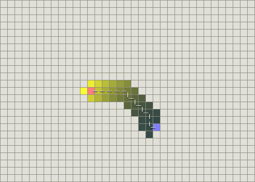

#A* Algorithm
#### Dijkstra算法与最佳优先搜索算法
- **Dijkstra**
Dijkstra算法从物体所在的初始点开始,访问图中的节点,它迭代检查待检查节点集中的结点,并把和该结点最靠近的尚未检查的结点加入待检查结点集.该结点集从初始点向外扩展,直到到达目标节点.Dijkstra算法保证能从一条初始点到目标点的最短路径,只要所有的边都有一个非负的代价值.

- **最佳优先搜索(BFS)**
最佳优先搜索算法按照类似的流程运行,不同的是它能够评估(称为启发式)任意结点到目标点的代价.与选择离初始结点最近的结点不同的是,它选择离目标结点最近的结点.BFS不能保证找到一条最短路径,然而,它比Dijkstra算法快得多,因为它用了一个启发式函数(heuristic function)快速导向目标结点.

然而在存在障碍物时,Dijkstra算法运行得较慢,但确实能保证找到一条最短路径,另一方面,BFS运行得较快,但是它找到的路径并不能保证是一条最好的路径.

问题在于BFS是基于贪心策略的,它试图向目标移动尽管这并不是正确路径,由于它仅仅考虑到目标的代价,而忽略了当前已经花费的代价,于是尽管路径已经变得很长,它仍然继续走下去.

结合两者的优点,1968年发明的A*算法就是把启发式(heuristic approaches)如BFS,和常规Dijkstra算法结合在一起的算法.有点不同的是,类似BFS启发式方法经常给出一个近似解而不是保证最佳解.然而A\*基于无法保证最佳解的启发式算法,A\*却能找到一条最短路径.

#### A*算法

A*算法是路径搜索中最受欢迎的选择,因为它相当灵活,并且能用于多种多样的情形中.
在讨论A*的标准术语中,$g(n)$表示从初始点到任意结点$n$的代价,$h(n)$表示从结点$n$到目标点的启发式评估代价.当初始点向目标点移动时,A\*权衡这两者.每次进行主循环时,它检查$f(n)$最小的节点$n$,其中$f(n)=g(n)+h(n)$
##### A*算法对启发式函数的使用
启发式函数可以控制A*的行为
- 如果h(n)=0,则只有g(n)起最庸,此时A*演变成dijkstra算法
- 如果h(n)比g(n)大很多,则只有h(n)起作用,A*演变成BFS算法
- 如果h(n)经常都比从n移动到目标的实际代价小（或者相等），则A\*保证能找到一条最短路径。h(n)越小，A*扩展的结点越多，运行就得越慢。
- 如果h(n)精确地等于从n移动到目标的代价，则A\*将会仅仅寻找最佳路径而不扩展别的任何结点，这会运行得非常快。尽管这不可能在所有情况下发生，你仍可以在一些特殊情况下让它们精确地相等（译者：指让h(n)精确地等于实际值）。只要提供完美的信息，A*会运行得很完美，认识这一点很好。
- 如果h(n)有时比从n移动到目标的实际代价高,则A*不能保证找到一条最短路径,但它运行得更快

> 在学术上,如果启发式函数值对实际代价低估,A*算法被称为简单的A算法.

##### 精确的启发式函数

首先 A*计算f(n)=g(n)+h(n).为了对这两个值进行相加,这两个值必须使用相同的衡量单位.

*在网格地图中的启发式函数*

- 曼哈顿距离(Manhattan distance).考虑你的代价函数并找到从一个位置移动到临近位置的最小代价D.启发式函数可以为曼哈顿距离的D倍:$$h(n)=D*(abs(n.x-goal.x)+abs(n.y-goal.y))$$
- 对角线距离,如果你的地图中允许对角运动,那么你需要一个不同的启发函数,(4 east,4 north)的曼哈顿距离将编程8*D,$$h(n)=D\*max(abs(n.x-goal.x),abs(n.y-goal.y))
- 欧氏距离 如果你的单位可以沿着任意角度移动（而不是网格方向），那么你也许应该使用直线距离 $$h(n) = D * sqrt((n.x-goal.x)^2 + (n.y-goal.y)^2)$$然而，如果是这样的话，直接使用A\*时将会遇到麻烦，因为代价函数g不会match启发函数h。因为欧几里得距离比曼哈顿距离和对角线距离都短，你仍可以得到最短路径，不过A*将运行得更久一些
- 平方后的欧氏距离使用距离的平方而避免欧几里得距离中昂贵的平方根运算$$h(n) = D * ((n.x-goal.x)^2 + (n.y-goal.y)^2)$$不要这样做！这明显地导致衡量单位的问题。当A\*计算f(n) = g(n) + h(n)，距离的平方将比g的代价大很多，并且你会因为启发式函数评估值过高而停止。对于更长的距离，这样做会靠近g(n)的极端情况而不再计算任何东西，A*退化成BFS
