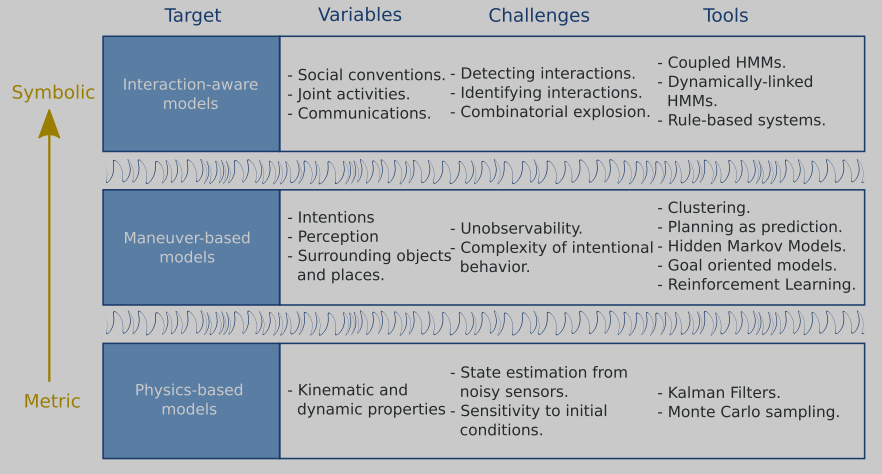

###### 关于行为预测的一点总结与想法
----
- > 看的一点论文和apollo源码分析,整理的一些想法和总结,供参考,不当之处以及任何想法和建议欢迎随时讨论,谢谢!
Create by:Zhiming 
Date: 2019.08.30
#####一点想法
当前XPilot行为预测思路:基于历史位置信息建立AR模型去预测横向偏移量,根据预测偏移量决定不同行为意图的概率,轨迹预测时直接基于预测意图确定不同的终止状态,对时间采样生成多条多项式曲线,以时长和预测轨迹的最大加速度加权和为代价函数,选择最小代价轨迹作为预测轨迹.
后续根据实车数据分析,可考虑改善方向:
- 行为预测方面:
    考虑结合障碍物类型和场景(车道,路口等,交通信号?等).设置预测处理优先级,太远或完全可忽略的障碍物不予处理.
    丰富预测行为集,左右变道,转向.
- 轨迹预测方面:
   当前轨迹生成同样未能考虑类型信息,所有类型目标俊按相同的代价函数进行预测生成.考虑加入曲率连续性,碰撞代价.
   对于代价函数的选择,考虑参考apollo方法,使用实车数据进行基于反馈神经网络学习获得.
   另外,轨迹预测时,当前我们以确定的终止速度,加速度,位移去生成轨迹,只对时间纬度进行采样,在位终止态是确定性行为,而预测本身是不确定性,根据测试结果,后续或许我们可以考虑在增加位置速度等维度上的采样,再结合自车运动状态和运动学约束与预测轨迹.

下面是apollo做法,和看到的论文部分总结:

#### Apollo预测

 **主要思想:** 
-  考虑不同类型障碍物的不同特征:如机动车受运动学,动力学约束,行人运动具有很强随机性
- 针对不同类型的输入特征使用不同的模型处理:
-- **障碍物自身信息**(长宽高,运动状态,历史轨迹)
-- **障碍物周围静态环境**(道路信息,路权,交通信号)
-- **障碍物周围动态环境**(与主车及其他车的交互).

- 行为预测优先级,提高计算效率及准确性.
-- 忽略处理(那些不影响本车轨迹,且可完全忽略的障碍物,比如距离很远的障碍物)
-- 谨慎处理 (针对那些存在一定交互可能性的障碍物).
-- 正常处理,默认情况 

行为预测:
分场景考虑,常规道路,机动车通常会沿着车道来行进,而在路口中,车的行为受到车道的约束相对较小,
###### 常规道路行为预测:
   -- 预测模型输入:自身历史运动状态,周围车道中心线信息
   -- 模型: 神经网络. 用Encoder(LSTM)对障碍物的运动历史进行编码,同时用另一套Encoder(LSTM或1D-CNN)对每条车道进行编码,然后对每条车道的Encoding经过一个MLP进行全局池化操作,如此得到一个对整体环境的编码(Environment Encoding)
   -- 输出: 选择某条车道的概率.把刚得到的障碍物本身的 Encoding，和对应的每条车道的 Encoding，再加上对整个环境的 Encoding 拼接到一起，然后再进行一个 Softmax 的操作。这样，我们可以得出一个对于每条车道的选择的概率
   -- 损失函数:交叉熵(cross-entropy loss)
###### 交叉路口行为预测:
-- 输入: 障碍物自身运动状态历史,路口车道信息,周围其他障碍物信息
-- 模型: 基于语义地图进行车道选择预测神经网络.
以障碍车朝向为参考方向,划分12个扇形区域,记录每个扇形区域是否有离开该路口的车道,将问题转化为多元(12元)分类问题.(不使用左转右转直行这样的三分类,而使用12元分类是因为现实路口出口数不确定,使用12扇形区覆盖所有路口问题).将车的历史状态,车道的形状和连接关系及其他车的运动状态和历史,都转化图像信息.
-- 输出:选择车道的概率
-- 损失函数:交叉熵

###### 考虑与自车交互的轨迹预测
根据意图估计得到的概率即为先验概率,然后对每个意图采样多条轨迹进行筛选，选出一条最为合理的轨迹进行采样.

行为预测(先验概率)--> 轨迹采样-->代价函数(加速度,向心加速度,碰撞)-->轨迹选择-->似然估计-->后验概率
针对每个行为预测的轨迹选择根据代价函数选择.
$C(\theta;\xi)=\theta_1 C_{acc}+\theta_2C_{centripetal_acc}+\theta_3C_{collision}$
$min \Sigma^{data}_{j}\Sigma^{sample}_{i}|C(\theta;\xi_j^{'})-C(\theta;\xi_i)+\delta|$
权重的选择:通过siamese神经网络+Relu得到损失函数输出,之后运用神经网络的方法反向传播,对权重参数进行训练.
最后于基于似然估计与先验概率的乘积获得后验概率的同时也生成了预测轨迹.

###### 行人轨迹预测
行人的轨迹相对会更加发散,自由和多远,其对地理位置的依赖会更小,行人走到哪都有可能.
模型输入: 障碍物自身运动状态历史,周围其他障碍物信息
模型:基于注意力机制的LSTM轨迹点预测神经网络
输出:障碍物未来n秒轨迹点
损失函数:均方误差,二维正太分布最大似然估计

##### 论文总结
- [A survey on motion prediction and risk assessment for intelligent vehicles](https://hal.inria.fr/hal-01053736/document)
综述性总结性文章.主要讨论总结了当前主流的三种预测思路,分别就改三种方式,并对这三种思路当前较多算法方式进行介绍分析.

基于物理模型方法主要是采用运动学或者动力学模型进行直接硬推或者MoteCarlo采样,该方法一般在超过一秒以后的轨迹预测不可靠.
基于Maneuver模型的方法则两种方式基于maneuver估计或者原型轨迹,则通过车的当前状态结合路网信息,生成轨迹簇,在结合当前车过去的状态信息,使用高斯过程回归或者其他方法学习到对应的原型轨迹,最后基于原型轨迹进行预测未来轨迹,该方法存在大量计算负担,没考虑车辆本身物理限制.第二种则考虑识别学习算法,如SVM/HMM/MLP/回归等传统机器学习方法.识别到意图后,再基于GP/PRT等去为每个manever生成采样轨迹.
基于Interaction-aware模型,大多基于DBN(动态贝叶斯网络) 
- [Multipolicy Decision-Making for AutonomousDriving via Changepoint-based Behavior Prediction](https://april.eecs.umich.edu/media/pdfs/galceran2015rss.pdf)
这篇文章,涉及决策和预测,决策层是基于POMDP的,在行为预测层是可以参考,其行为覆盖了lane_keep,lane_chage,turn_left,turn_right,go_straight,yield.Stop,
其行为预测方法期方法基于对每个车辆的观察状态的历史的分段，其中每个分段与最可能已经生成该分段中的观察到的行为相关联,使用贝叶斯变换点检测获得这种分割，该检测推断了观察历史中产生观测结果的基本行为发生变化的点,给定最近段中的观察结果的情况下计算目标车的所有可用行为的可能性,当前时间步长上捕获汽车潜在行为的分布图.
