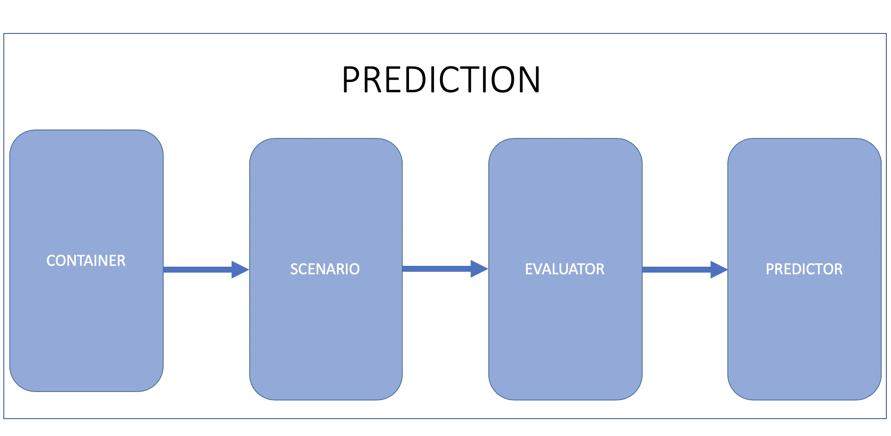

#预测
----
#### 介绍

预测模块接受感知模块的障碍物信息,包括航向,位置,速度,加速度,然后生成那些障碍物带概率的轨迹.

#### 输入

- 来自感知模块的障碍物信息
- 来自定位模块的定位信息
- 规划模块上一个计算周期规划的轨迹

#### 输出

用预测轨迹及其优先级标注的障碍。 现在计算障碍优先级，因为各个方案的优先级不同。 优先级包括：忽略，警告和正常（默认）

#### Functionalities

预测模块由四个主要的functionalities组成: Container,Scenario,Evaluator,predictor.
Container,Evaluator,Predictor存在于Apollo 3.0,3.5之后引入Scenario.

##### Container

存储来自订阅管道的输入数据,包括 感知障碍物,车辆定位,车辆规划

##### Scenario

当前定义了两个场景
- Cruise :这个场景下包括车道保持和跟随
- Junction: 这个场景涉及交叉口,交叉口有交通信号灯或停止标志

##### Obstacles

- Ignore: 那些障碍物将不影响本车的轨迹并且能安全忽略(如,障碍是非常远的)
- Caution: 警告,那些障碍物有高可能性和本车进行交互
- Normal: 忽略和警告之间,为默认值

##### Evaluator 评估器

对于给定障碍物评估预测轨迹和速度.评估器评估一个路径通过使用存在 prediction/data/中的模型去输出它(lane sequence)的概率.

有五种类型的评估:
- Cost evaluator: 通过一系列代价函数计算概率
- MLP evaluator: 使用一个MLP模型去计算概率
- RNN evaluator: 使用一个RNN模型去计算概率
- Cruise MLP + CNN-1d evaluator: 对于cruise 场景,使用一个MLP和 CNN-1d混合模型去计算概率
- Junction MLP evaluator: 在交叉口场景,使用MLP模型去计算概率
- Junction Map evaluator: 使用基于语义图的CNN模型计算交叉情景的概率。此评估程序是为警告级别障碍而创建的
- Social Interaction evaluator: 这个模型用于杏仁,用于短期轨迹预测,它使用Social LSTM模型,这个评估器创建警告级别的障碍物

##### Predictor

当前支持的预测器包括:
- Empty: 障碍物没有预测轨迹
- Single lane: 在告诉导航模式,障碍物沿着单车道运动,不在车道上的障碍物将被忽略
- Lane sequence: 障碍物沿着车道运动
- Move sequence: 障碍物沿着车道移动，遵循其动力学模式
- Free movement: 障碍物自由运动
- Regional movement: 障碍物在一个可能的区域运动
- Junction: 障碍物以高概率向交叉口出口运动
- Interation predictor: 在所有评估者运行后计算创建后验预测结果的可能性。此预测器是为警告级别障碍而创建的
##### 预测架构

prediction通过感知障碍物的消息触发

